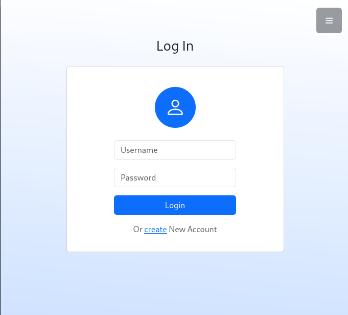
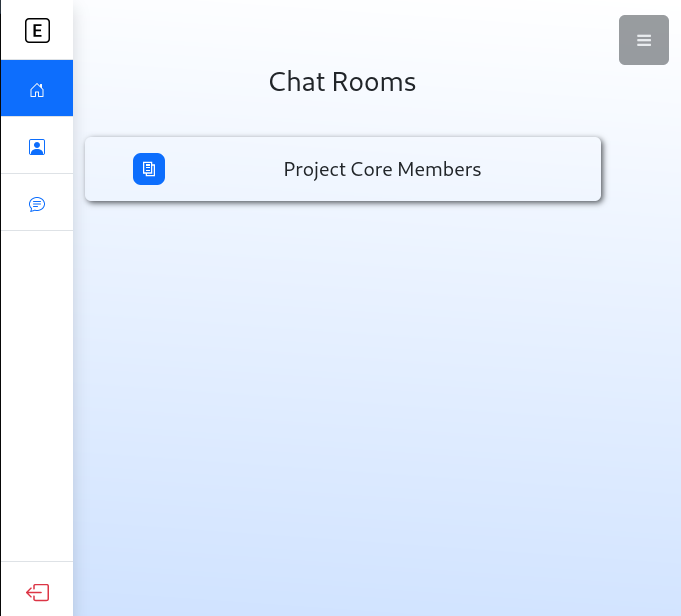

# E_chat

This is a Chatroom Web Application made with flask




### About

A webapp in which you can create different rooms that enables you to chat with people that have access to the group.

### Features

With wide range of features which include:

- User Authentication
- Creating ChatRooms
- Adding password requirements to the chatroom
- Joining different rooms with a password
  


## Getting Started

### Installation

1. Check if python is installed on your system using

```bash
python -V
```

if not download it [here](https://python.org/downloads/). It is advicable to get python 3.10 or later.

2. Clone the repository using:

```bash
git clone https://github.com/Ecode2/E_chat.git
```

3. Navigate into the project directory with:

```bash
cd E_chat
```

4. Install application requirements using:

```bash
pip install -r requirements.txt
```


## Using The App

Start up the app with

```bash
gunicorn --worker-class eventlet -w 1 run:app
```

then go to ```localhost:8000``` on your browser and thats it


## Contributing

Contributions are welcome! If you want to contribute to this project, please follow these steps:

1. Fork the repository.
2. Create a new branch: ```git checkout -b feature/new-feature```
3. Make your changes and commit them: ```git commit -m 'Added a new feature'```
4. Push to the branch: ```git push origin feature/new-feature```
5. Submit a pull request.
